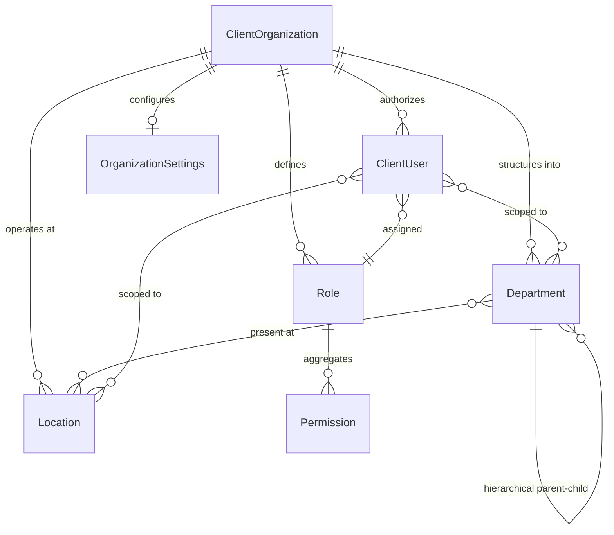

# HRIS Client Admin — Product & Domain Architecture

## 1. Executive Summary & Product Context

The **HRIS Client Admin Web** is an independent, multi-tenant web application purpose-built for client companies to manage their daily human resources, workforce operations, attendance, leaves, and payroll processing.

Unlike the HRIS Super Admin platform (which governs billing, tenant provisioning, system monitoring, and global platform configuration), the Client Admin portal operates strictly within the organizational scope of an individual client company.

```text
┌─────────────────────────────────────────────────────────────┐
│                        HRIS Platform                        │
└──────────────────────────────┬──────────────────────────────┘
                               │ provisions
                               ▼
┌─────────────────────────────────────────────────────────────┐
│                 Client Company (Organization)               │
└──────────────────────────────┬──────────────────────────────┘
                               │ employs & authorizes
                               ▼
┌─────────────────────────────────────────────────────────────┐
│                         Client Users                        │
└──────────────────────────────┬──────────────────────────────┘
                               │ assigned
                               ▼
┌─────────────────────────────────────────────────────────────┐
│                            Roles                            │
└──────────────────────────────┬──────────────────────────────┘
                               │ grants
                               ▼
┌─────────────────────────────────────────────────────────────┐
│                         Permissions                         │
└──────────────────────────────┬──────────────────────────────┘
                               │ enables
                               ▼
┌─────────────────────────────────────────────────────────────┐
│                        HR Operations                        │
│   (Organization, Employees, Attendance, Leaves, Payroll)   │
└─────────────────────────────────────────────────────────────┘
```

---

## 2. The Role-Based UI Principle

A foundational rule of this architecture is: **Never assume every client user is a Super Admin or has unrestricted access.**

All client portal user experiences are dynamically shaped by their authenticated identity, assigned roles, and atomic permissions:

```text
User
  │
  ▼
Assigned Role(s)
  │
  ▼
Resolved Permissions
  │
  ├──► Accessible Navigation (Sidebar shows only authorized items)
  │
  ├──► Route Access (ProtectedRoute guards routes against direct URL entry)
  │
  └──► Accessible Actions (ActionGuard & useAuthorization toggle action controls)
```

---

## 3. Domain Entity Architecture

### 3.1 Domain Models Overview



---

### 3.2 Core Entities

#### 1. Client Organization (`ClientOrganization`)
* **Purpose**: Top-level multi-tenant boundary for a client enterprise.
* **Fields**:
  - `id`: Unique tenant identifier.
  - `name`: Display trading name.
  - `legalName`: Official registered company name.
  - `slug`: URL and subdomain identifier.
  - `domain`: Corporate email domain for auto-discovery or SSO.
  - `logoUrl`: Brand asset.
  - `headquartersLocationId`: Primary workplace reference.
  - `taxIdentifier`: Corporate tax ID / EIN / VAT number.
  - `defaultCurrency`: ISO currency code (e.g. `USD`, `EUR`, `GBP`).
  - `defaultTimezone`: IANA timezone string (e.g. `America/New_York`).
  - `status`: Lifecycle state (`active`, `pending`, `suspended`).

#### 2. Workplace Location (`Location`)
* **Purpose**: Represents physical campuses, regional offices, or virtual hubs. Supports localized labor laws, holiday calendars, and geofencing.
* **Fields**:
  - `id`: Unique location identifier.
  - `organizationId`: Owning client company.
  - `code`: Unique code (e.g. `HQ-SF`, `LDN-01`).
  - `name`: Location name.
  - `address`: Structured postal address (line1, line2, city, state, postalCode, country).
  - `timezone`: IANA timezone for local attendance tracking.
  - `isHeadquarters`: Primary corporate headquarters indicator.
  - `contact`: Regional office phone & email.
  - `status`: `active` or `inactive`.

#### 3. Department (`Department`)
* **Purpose**: Organizational units, divisions, and teams. Supports recursive parent-child hierarchy and multi-location operations.
* **Fields**:
  - `id`: Unique department identifier.
  - `organizationId`: Owning client company.
  - `code`: Department code (e.g. `ENG`, `MKT`, `FIN`).
  - `name`: Full title.
  - `description`: Optional mission or scope summary.
  - `parentDepartmentId`: Self-referential parent for tree topologies.
  - `headEmployeeId`: Leadership employee reference.
  - `locationIds`: Associated physical/remote office IDs.
  - `status`: `active` or `inactive`.

#### 4. Client User (`ClientUser`)
* **Purpose**: Identity authorized to interact with the Client Admin Web portal.
* **Fields**:
  - `id`: Unique identity ID.
  - `organizationId`: Tenant association.
  - `email`: Corporate email address.
  - `firstName` & `lastName`: Profile name.
  - `avatarUrl`: User avatar.
  - `role`: Assigned role code (e.g. `org_admin`, `hr_manager`, `payroll_admin`).
  - `roleId`: Custom or system role identifier.
  - `departmentIds`: Departmental operational scope.
  - `locationIds`: Location operational scope.
  - `employeeId`: Linked staff record (if user is also an employee).
  - `isEmailVerified`: Identity security verification status.
  - `status`: `active`, `pending`, `suspended`.

#### 5. Role (`Role`)
* **Purpose**: Named collection of permissions representing a client persona.
* **Fields**:
  - `id`: Unique role identifier.
  - `organizationId`: Owning client company.
  - `code`: Key code (`org_admin`, `hr_manager`, `payroll_admin`, `dept_head`, `employee`).
  - `name`: Human-readable title.
  - `description`: Scope summary.
  - `permissions`: Set of granular `Permission` keys.
  - `isSystemRole`: Immutable system default flag.
  - `isCustomRole`: Organization-defined custom role flag.
  - `status`: `active` or `inactive`.

#### 6. Permission (`Permission`)
* **Purpose**: Atomic capability strings (`module:action`) evaluated at runtime.
* **Categories**:
  - `org:*`: Organization profile management.
  - `departments:*`: Department CRUD.
  - `locations:*`: Location CRUD.
  - `users:*` & `roles:*`: Client user administration.
  - `employees:*`: Workforce directory and profiles.
  - `attendance:*`: Check-in tracking and logs.
  - `leaves:*`: Time-off balance and approvals.
  - `payroll:*`: Pay run processing and disbursements.
  - `reports:*`: Business intelligence and exports.
  - `settings:*`: Operational rules and configurations.

#### 7. Organization Settings (`OrganizationSettings`)
* **Purpose**: Centralized policies dictating operational rules across all modules.
* **Sub-configurations**:
  - `localization`: Currency, timezone, date/time format conventions.
  - `workSchedule`: Working days (e.g. Mon–Fri) and standard daily hours.
  - `fiscalYear`: Start month and day.
  - `attendance`: Geofencing requirements, IP lock, auto-approval thresholds.
  - `leaves`: Year cycle anchor (calendar year vs fiscal year vs anniversary), negative balance rules.
  - `payroll`: Pay frequencies (monthly, biweekly), currency, default tax identification.
  - `enabledModules`: Tenant-level feature flags.

#### 8. HR Modules (`HRModuleDefinition`)
* **Purpose**: Module registry defining navigation, routes, and required permissions.
* **Core vs Optional Modules**:
  - **Core** (Always enabled): Organization, Employees, Settings.
  - **Modular** (Configurable per subscription/need): Attendance, Leaves, Payroll, Reports, Recruitment, Performance.

---

## 4. Role & Permissions Matrix

| Operational Capability | Org Admin | HR Manager | Payroll Admin | Dept Head | Employee |
| :--- | :---: | :---: | :---: | :---: | :---: |
| **View Organization Profile** |  Full |  Full |  Full |  Full |  None |
| **Manage Organization Profile** |  Full |  None |  None |  None |  None |
| **Manage Departments & Locations** |  Full |  Full |  None |  None |  None |
| **Manage Client Users & Roles** |  Full |  None |  None |  None |  None |
| **View Employees** |  Full |  Full |  Full |  Dept-Only |  Self |
| **Manage Employees (Create/Edit)**|  Full |  Full |  None |  None |  None |
| **View Attendance Logs** |  Full |  Full |  Full |  Dept-Only |  Self |
| **Record Attendance / Clock-in** |  Full |  Full |  Full |  Full |  Self |
| **Manage Attendance / Overrides** |  Full |  Full |  None |  None |  None |
| **View Leave Records** |  Full |  Full |  Full |  Dept-Only |  Self |
| **Apply for Leave** |  Full |  Full |  Full |  Full |  Self |
| **Approve Leave Requests** |  Full |  Full |  None |  Dept-Only |  None |
| **View Payroll Summaries** |  Full |  None |  Full |  None |  Self-Slip |
| **Process Pay Runs** |  Full |  None |  Full |  None |  None |
| **View & Export Reports** |  Full |  Full |  Full |  Dept-Reports |  None |
| **Manage Organization Settings** |  Full |  None |  None |  None |  None |

---

## 5. Frontend & UX Architecture Implementation

### 5.1 Dynamic Navigation
The sidebar navigation ([Sidebar.tsx](file:///Users/aswani/Desktop/react/hris-client-web/src/layouts/Sidebar.tsx)) automatically evaluates the authenticated user's permissions:

```tsx
const accessibleNavItems = navItems.filter((item) => {
  if (!item.requiredPermission) return true;
  return can(item.requiredPermission);
});
```

### 5.2 Declarative Action Guarding
Action buttons, links, and operational controls are guarded in the template using `<ActionGuard>`:

```tsx
<ActionGuard permission={PERMISSIONS.EMPLOYEES_CREATE}>
  <Button onClick={openAddEmployeeModal}>Add Employee</Button>
</ActionGuard>
```

### 5.3 Programmatic Authorization Hook
Complex business rules or view behaviors utilize `useAuthorization`:

```tsx
const { can, is } = useAuthorization();

if (can(PERMISSIONS.PAYROLL_PROCESS)) {
  // Render payroll execution workbench
}
```

---

## 6. Phase Roadmap

* **Step 1 (Complete)**: Initial application foundation, Vite + TS + ESLint tooling, layout shell, base styles.
* **Step 2 (Complete)**: Domain and product architecture, lightweight extensible TypeScript models, RBAC engine, dynamic navigation/action guards.
* **Step 3 (Upcoming)**: Organization profile, Locations, and Departments management screens.
* **Step 4 (Upcoming)**: Employee directory and workforce profiles.
* **Step 5 (Upcoming)**: Time & Attendance tracking module.
* **Step 6 (Upcoming)**: Leave and absence management workflows.
* **Step 7 (Upcoming)**: Payroll execution engine.
